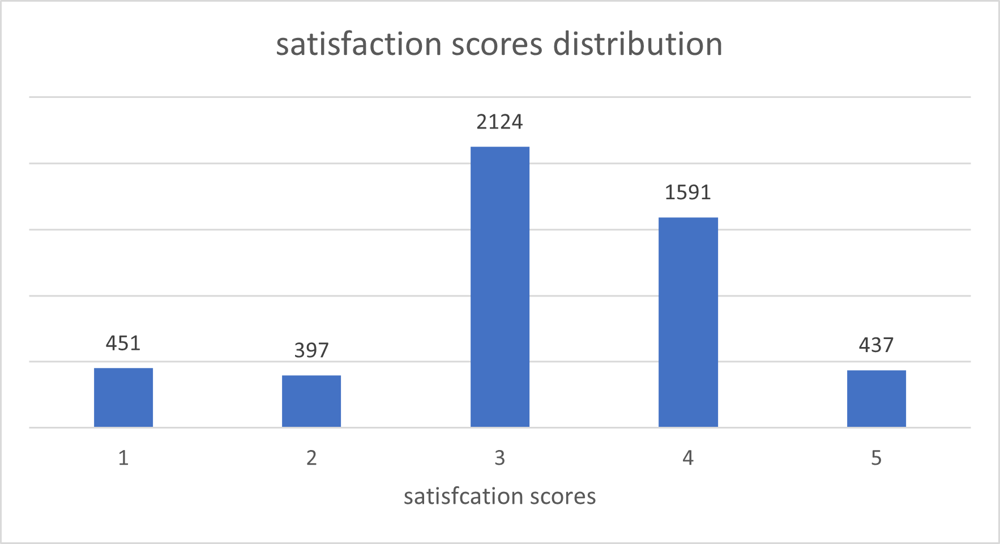
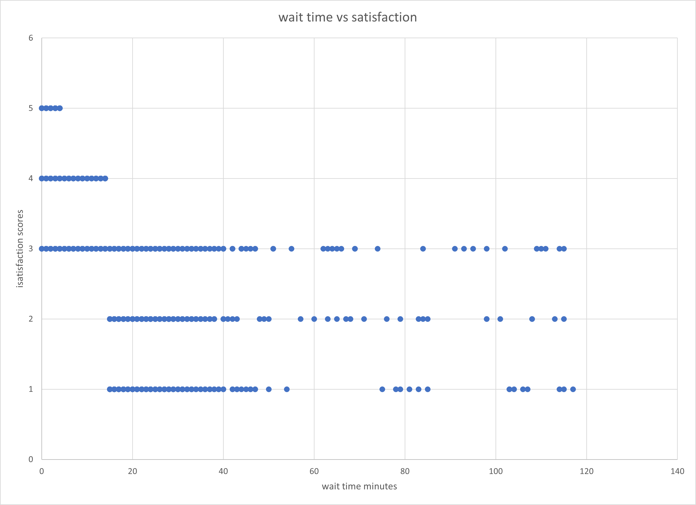
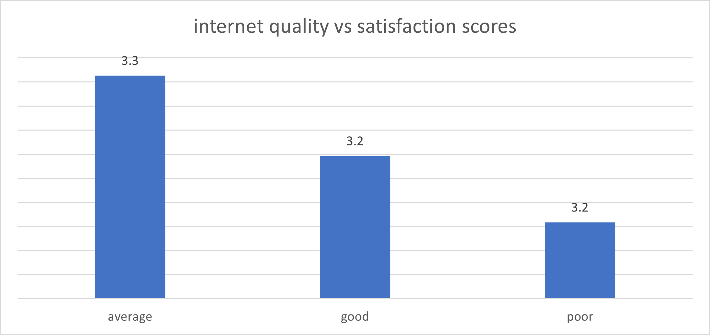
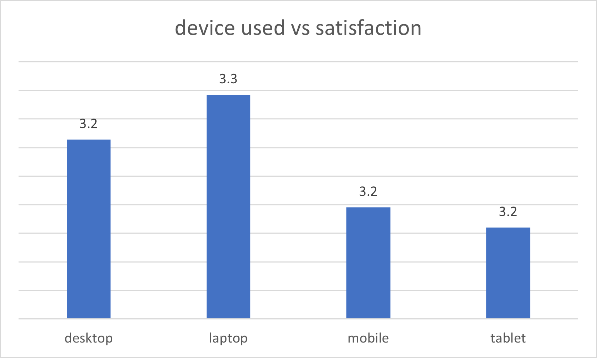
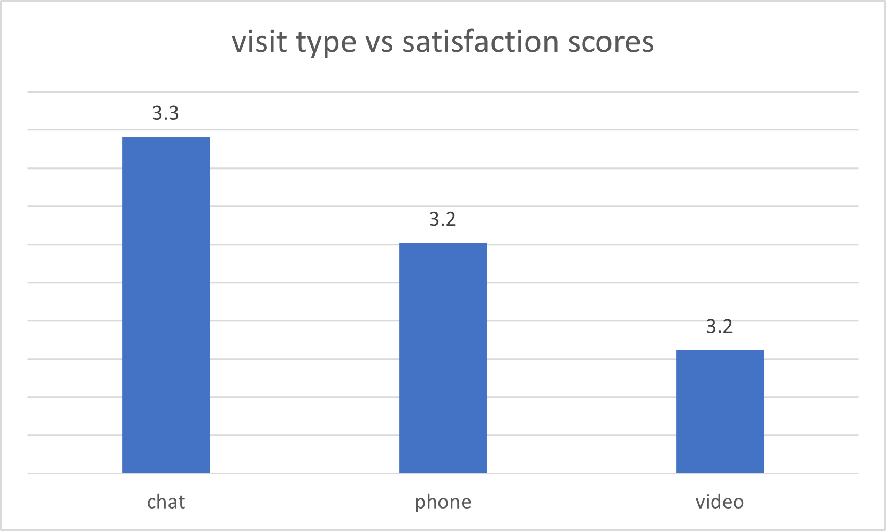
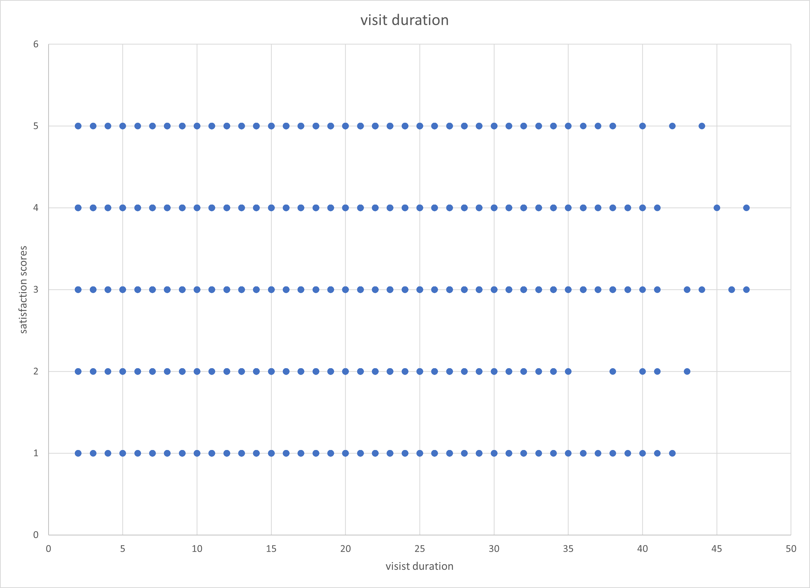

# Telehealth Patient Experience Analysis

## executive summary

The Doctor on Mobile project evaluates BetaHealth Clinic’s telehealth pilot program to determine whether the service delivers a positive patient experience before large-scale expansion.

The analysis explored how operational and technical factors—including wait times, internet quality, visit duration, and consultation methods—influence patient satisfaction during virtual healthcare visits.

The findings revealed moderate overall satisfaction (average score: 3.23/5), with wait time emerging as the strongest driver of patient dissatisfaction. Satisfaction declined significantly when wait times exceeded 15 minutes, while technical issues had less impact than expected.

These insights suggest that improving operational efficiency and optimizing mobile telehealth experiences could increase patient retention, improve satisfaction, and support successful program expansion.

## problem statement
Doctor on Mobile is a telehealth pilot program launched by BetaHealth Clinic to provide remote medical consultations. The program aims to improve access to healthcare while reducing patient wait times and increasing convenience.

Before expanding the program, healthcare administrators need to evaluate whether it delivers a positive patient experience and identify the key factors influencing patient satisfaction during virtual visits.

Understanding these factors helps administrators determine whether the telehealth service meets patient expectations and whether the pilot should be scaled. If issues affecting satisfaction are not addressed, patients may be less likely to recommend or continue using the service, which could limit adoption and reduce the potential benefits of telehealth.

Using telehealth visit data, this analysis explores how operational factors, technological conditions, and visit characteristics influence patient satisfaction, helping administrators make data-driven decisions about improving and scaling the program.

## dataset

This project uses a synthetic telehealth dataset generated for portfolio purposes.

The dataset was designed to simulate realistic telehealth operations and patient satisfaction scenarios while avoiding the privacy and ethical concerns associated with real healthcare data.

The synthetic data includes operational, demographic, and service-related variables commonly analyzed in healthcare analytics.

### dataset features

| Column Name | Data Type | Description |
|---|---|---|
| visit_id | Integer | Unique identifier for each telehealth visit |
| patient_id | Integer | Unique identifier for each patient |
| age | Integer | Age of the patient |
| age_groups | Categorical | Grouped age categories used for analysis |
| gender | Categorical | Gender of the patient |
| state | Categorical | Patient's state or location |
| insurance_type | Categorical | Type of patient insurance coverage |
| visit_date | Date | Date of telehealth consultation |
| visit_type | Categorical | Consultation method (video, audio, chat, etc.) |
| provider_speciality | Categorical | Medical specialty of the healthcare provider |
| wait_time_minutes | Numeric | Time spent waiting before consultation |
| wait_time_grouped | Categorical | Grouped wait time categories |
| visit_duration_minutes | Numeric | Length of the consultation session |
| visit_duration_grouped | Categorical | Grouped consultation duration categories |
| technical_issues | Categorical | Indicates whether technical issues occurred |
| satisfaction_scores | Integer | Patient satisfaction rating score |
| would_recommend | Categorical | Indicates whether the patient would recommend the service |
| followup_needed | Categorical | Indicates whether a follow-up consultation was required |
| device_used | Categorical | Device used during the consultation |
| internet_quality | Categorical | Quality of internet connection during consultation |
| previous_visits | Integer | Number of previous telehealth visits by the patient |

## Tools Used

### Microsoft Excel
- Data Cleaning
- Data Transformation
- Exploratory Data Analysis
- Visualization

### Excel Features & Functions
- Pivot Tables
- IF Functions
- COUNTBLANK
- TRIM
- UNIQUE
- LOWER
- AVERAGE, MEDIAN, COUNT
- Conditional Formatting
- Charts

## Skills Demonstrated

- Data Cleaning
- Missing Value Handling
- Duplicate Detection
- Data Transformation
- Exploratory Data Analysis (EDA)
- Data Visualization
- Pattern Recognition
- Business Insight Generation
- Healthcare Analytics
- Data Storytelling
- Problem Solving
- Communication of Analytical Findings

## project workflow
1. Data Cleaning
2. Data Transformation
3. Exploratory Data Analysis
4. Visualization
5. Pattern Identification
6. Business Insight Generation
7. Strategic Recommendations

## 1. data cleaning
- **Duplicates**
    - Checked for duplicate records and confirmed true duplicates.
    - Removed duplicates, reducing the dataset from 5,100 to 5,000 rows.
- **Missing Values**
    - Identified 2,272 missing entries using `COUNTBLANK`.
    - Imputed numerical columns (e.g., `age`) with the mean.
    - Filled categorical columns (e.g., `state`) with the mode.
    - Verified that no missing values remained after cleaning.
- **Text and Categorical Data**
    - Standardize text by converting to lowercase for consistency.
    - Removed extra spaces using `TRIM`.
    - Checked unique values to correct inconsistent categories.
- **Dates**
    - Converted date columns to the correct datetime format.
    - Standardized date representation across the dataset.
- **Data Types**
    - Ensured all columns have the correct datatype (numerical, categorical, or datetime).
- **Verification**
    - Inspected each column individually to confirm correctness and consistency.

 

 ## 2.data transformation
To make the dataset easier to analyze, continuous numerical variables were grouped into categories using Excel IF formulas. The transformed variables included Age, Wait Time, and Visit Duration.

Age was grouped into ranges such as 18–24, 25–34, 35–44, and above.
Wait Time was grouped into categories such as 0–10 minutes, 11–30 minutes, 31–60 minutes, and above.
Visit Duration was grouped into intervals such as 2–10 minutes, 11–20 minutes, 21–30 minutes, and above.

Excel IF formulas were used to automatically assign each record to its appropriate category based on the original numerical value.

These transformations helped simplify the dataset, improve analysis, and make patterns easier to identify during visualization

## Descriptive Statistics

Descriptive statistics were calculated for key numerical features in the telehealth dataset to summarize the main characteristics of the data.

The analysis focused on:
- patient age
- wait time
- visit duration
- satisfaction scores
- previous visits

The statistics helped identify:
- average patient behavior
- variability in operational performance
- possible outliers
- overall distribution patterns

### Metrics Calculated
- Mean
- Median
- Minimum
- Maximum
- Standard Deviation

### Descriptive Statistics Summary

| Feature | Min | Max | Average | Mode | Median | Std Dev |
|---|---|---|---|---|---|---|
| Age | 18 | 84 | 51.15 | 51 | 18 | 18.62 |
| Wait Time (minutes) | 0 | 117 | 12.38 | 5 | 10 | 11.65 |
| Visit Duration (minutes) | 2 | 47 | 19.54 | 20 | 19 | 7.82 |
| Satisfaction Scores | 1 | 5 | 3.23 | 3 | 3 | 1.03 |
| Previous Visits | 0 | 11 | 3.01 | 2 | 3 | 1.74 |

### Key Observations

#### 1. Patient Demographics
- The average patient age was approximately 51 years.
- The wide age range (18–84) suggests the telehealth service was used across multiple age groups.

#### 2. Wait Time Analysis
- The average wait time was approximately 12 minutes.
- However, the maximum wait time reached 117 minutes, indicating possible operational bottlenecks or scheduling inefficiencies during certain visits.

#### 3. Visit Duration Patterns
- Most consultations lasted around 20 minutes.
- The relatively low standard deviation suggests visit durations were fairly consistent across patients.

#### 4. Satisfaction Trends
- The average satisfaction score was 3.23 out of 5, indicating moderate patient satisfaction overall.
- The low standard deviation suggests patient ratings were relatively concentrated around the middle satisfaction levels.

#### 5. Previous Telehealth Usage
- Patients had an average of 3 previous visits, suggesting recurring usage and some level of continued engagement with the telehealth service.

## spotting patterns and relationships

## overall satisfaction

Findings: Most people gave a middle-of-the-road score of 3 (2,124 patients). While many gave a 4, very few people gave a perfect 5.

Interpretation: The service works, but it isn't "wowing" most patients yet.

Business Insights: We have a lot of "okay" experiences that need to be turned into "great" experiences to keep people coming back.

## the impact of waiting

Findings: Patients who waited less than 10 minutes were the only ones who gave perfect scores. Once the wait passed 15 minutes, the high scores disappeared completely.

Interpretation: People choose telehealth for speed. If they have to wait, the main benefit of the service is lost.

Business Insights: We must keep wait times under 15 minutes to keep patients happy.

## technology and devices

Findings: Laptops had slightly higher satisfaction scores (3.3) than phones or tablets (3.2). Interestingly, "average" internet actually had higher scores than "good" internet.

Interpretation: The app works well even if the internet isn't perfect, but it seems a bit easier to use on a laptop.

Business Insights: We should make sure the mobile and tablet versions are just as easy to use as the laptop version.

## Type of Visit and Time Spent

Findings: Chat visits had the highest satisfaction (3.3) compared to video or phone. How long the visit lasted didn't change satisfaction much, though shorter visits were slightly more popular.

Interpretation: Patients seem to like the ease and privacy of texting/chatting with their doctor.

Business Insights: We should promote the chat feature since it’s popular and likely cheaper to run

## **Business Recommendations for Doctor on Mobile**

* **Improve the "Middle" Experience**: Reach out to patients who give neutral scores (3 out of 5) to learn what would turn their visit into a perfect 5.
* **Enforce a 15-Minute Wait Limit**: Ensure doctors see patients within 10 to 15 minutes, as satisfaction drops sharply when wait times exceed this window.
* **Optimize the Mobile Experience**: Update the phone and tablet apps to be as easy to navigate and stable as the laptop version.
* **Prioritize the Chat Feature**: Promote "Chat" as a primary communication method since patients currently rate it higher than phone or video calls.
* **Troubleshoot Video Friction**: Investigate whether video calls are rated lower due to technical glitches or user discomfort, and provide simple fixes for those issues.
* **Scale to Areas with Average Internet**: Confidently expand the program to locations without high-speed fiber, as patients remain satisfied even with average connection quality.
  
 

